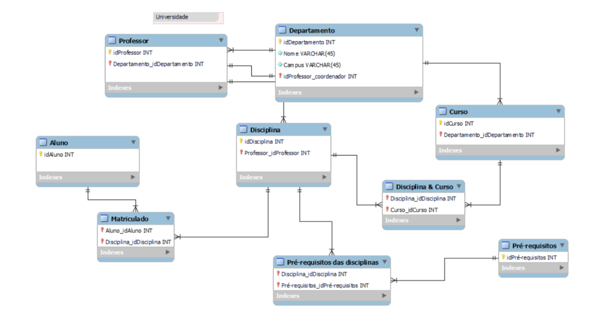
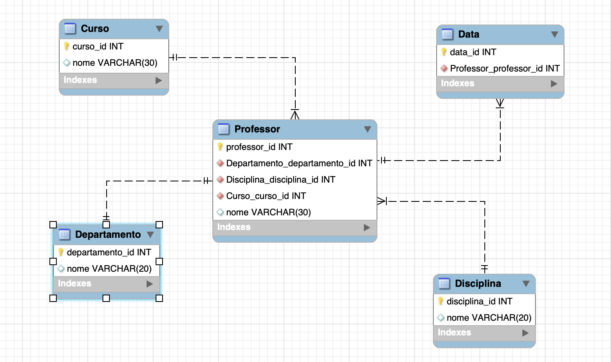

## Descrição do desafio de modelagem dimensional

**Objetivo**

O objetivo deste desafio é criar o diagrama dimensional - star schema - com base no diagrama relacional disponibilizado.

**Foco**

O foco deste desafio é analisar os dados dos professores. Será montado um esquema em estrela com a tabela fato refletindo diversos dados sobre os professores, cursos ministrados e departamento ao qual pertencem.

Obs.: Não é necessário incluir dados sobre os alunos!

**O que deve ser feito?**

Deverá ser criada a tabela Fato que conterá o contexto analisado. Além disso, é necessário criar as tabelas dimensão que serão compostas pelos detalhes relacionados ao contexto.

Por fim, adicione uma tabela dimensão de datas. Para compensar a falta de dados de datas no modelo relacional, suponha que você tenha acesso aos dados e crie os campos necessários para a modelagem. Por exemplo, data de oferta das disciplinas, data de oferta dos cursos, entre outros. O formato e a granularidade dos dados podem variar.

**Imagem de referencia**

### Resolução

